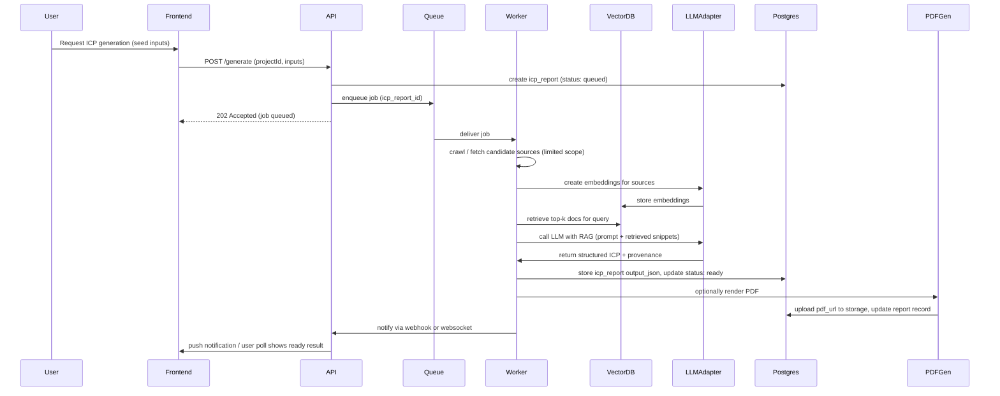
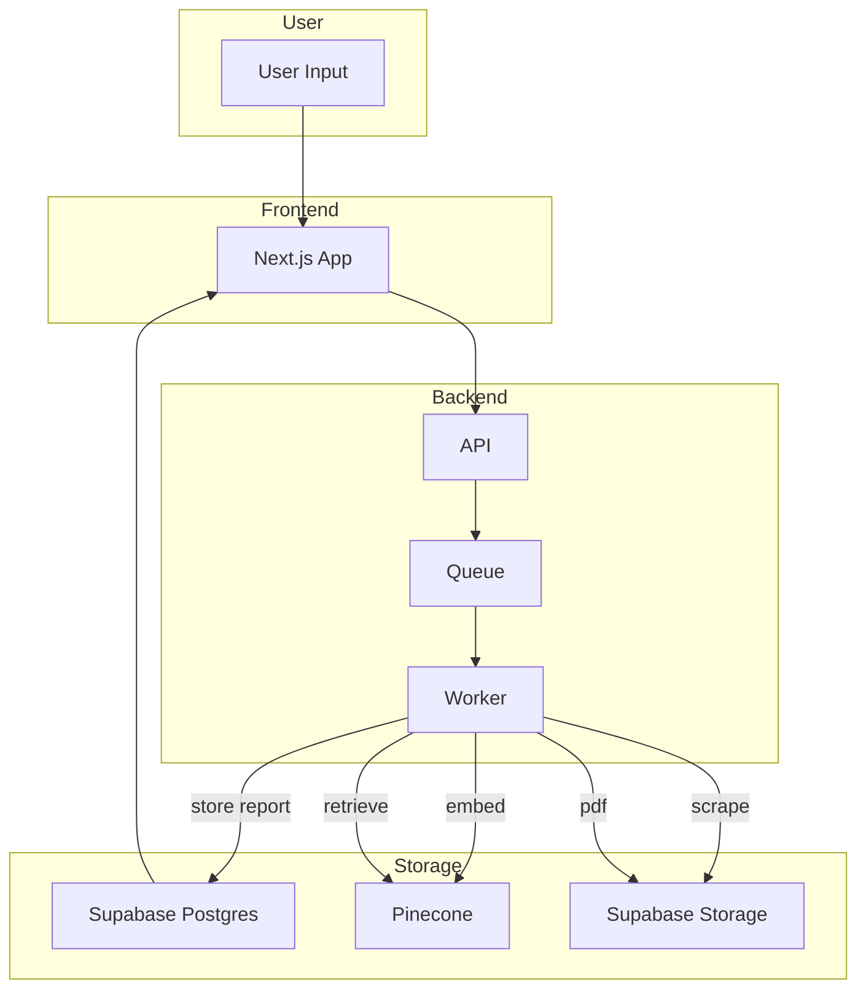

# Architecture decisions — component & data-flow

Purpose
This document records the high-level architecture, component diagrams, data flows, and rationale for the Elsa-like AI Marketing Assistant MVP. It is aligned to the chosen stack: Vercel, Supabase, OpenAI/OpenRouter, and Pinecone.

Scope
- Component-level architecture (frontend, API, workers, vector store, DB, storage)
- RAG and ICP generation sequence
- Data flow and provenance requirements
- Tradeoffs and alternatives

Chosen stack (MVP)
- Frontend: Next.js (React + TypeScript) on Vercel
- Auth / relational DB / storage: Supabase (Postgres + Auth + Storage)
- Vector DB: Pinecone (managed). Fallback: Supabase + pgvector
- Embeddings & LLM: OpenAI (adapter to support OpenRouter/other providers)
- Background workers: Cloud Run or AWS Fargate (small container) consuming Redis/BullMQ
- Job queue: Redis (managed) or hosted alternative
- PDF generation: Puppeteer in a worker container
- Payments: Stripe + Razorpay (INR / UPI)
- Observability: Sentry + OpenTelemetry + Prometheus (for workers)

High-level component overview
- Client (browser/mobile) — Next.js app on Vercel
- API Gateway / Serverless API — Next.js API routes or separate Node/TS API (Fastify/NestJS)
- Relational DB — Supabase Postgres (users, projects, reports, billing)
- Vector Store — Pinecone (embeddings + retrieval)
- Embeddings/LLM Adapter — a thin service that abstracts OpenAI/OpenRouter calls and model switching
- Worker(s) — scrape/index, embed, retrieval, LLM invocations, PDF rendering
- Storage — Supabase Storage or S3 for PDFs, assets
- Payments — Stripe & Razorpay integrations called from backend
- Admin UI — internal dashboard for moderation and billing

Key constraints & requirements applied
- Evidence provenance: every generated claim must reference source URL(s) and snippet(s)
- Cost control: batching embeddings, caching retrievals, and reuse of embeddings
- Low ops initially: prefer managed services and serverless for primary components

Component diagram (Mermaid)
[`mermaid`](docs/archDecisions/architecture.md:1)
```mermaid
graph LR
  User[User Browser / Mobile]
  Frontend[Next.js on Vercel]
  API[API (Node TS) / Vercel or Cloud Run]
  Auth[Supabase Auth]
  Postgres[Supabase Postgres]
  Storage[Supabase Storage / S3]
  Queue[Redis Queue (BullMQ)]
  Worker[Worker (Cloud Run / Fargate)]
  Pinecone[Vector DB (Pinecone)]
  EmbeddingAPI[Embeddings & LLM Adapter (OpenAI / OpenRouter)]
  PDFGen[Puppeteer PDF Worker]
  Payments[Stripe / Razorpay]
  Admin[Admin Dashboard]
  Observability[Monitoring & Logs (Sentry / Prometheus)]

  User --> Frontend
  Frontend --> API
  Frontend --> Auth
  API --> Postgres
  API --> Storage
  API --> Queue
  Queue --> Worker
  Worker --> EmbeddingAPI
  Worker --> Pinecone
  Worker --> Postgres
  Worker --> PDFGen
  API --> Payments
  Admin --> API
  API --> Observability
  Worker --> Observability
```

Sequence diagram: ICP generation (Mermaid)
[`mermaid`](docs/archDecisions/architecture.md:1)


Data flow (Mermaid)
[`mermaid`](docs/archDecisions/architecture.md:1)


Component responsibilities & rationale
- Frontend (Next.js on Vercel)
  - Fast, SEO-friendly marketing pages + SPA for app
  - Server-side rendering for public pages and client-side for app flows
  - Advantage: low friction deployment and CDN
- API (Node.js + TypeScript)
  - Thin API surface for auth, project CRUD, job enqueue, payments, admin endpoints
  - Deployable as serverless functions for low ops on Vercel or as container on Cloud Run
- Worker
  - Handles heavy tasks: scraping, embeddings, indexing, LLM calls, PDF rendering
  - Long-running tasks better in container runtime with retry semantics
- Vector DB (Pinecone)
  - Managed, scalable, low operational overhead for MVP
  - Alternative: pgvector in Supabase for cost constrained environments
- Embeddings & LLM Adapter
  - Abstracts provider differences (OpenAI, OpenRouter, Anthropic)
  - Central place for rate-limiting, retries, prompt templating, and cost control
- Storage (Supabase Storage / S3)
  - Store PDF reports, images, assets and archived crawled pages
- Payments
  - Stripe for global cards; Razorpay for Indian payments and UPI
- Observability
  - Capture errors (Sentry), traces (OpenTelemetry), metrics (Prometheus) for workers and API

RAG & provenance design details
- Source ingestion
  - Small, targeted crawler or third-party APIs (news, web snapshots) — limit to a safe list of domains for MVP
  - Store raw HTML + extracted text + metadata in storage with source_id
- Embedding & indexing
  - Chunk text into 500–1000 token passages with metadata (source_url, title, position)
  - Create embeddings and upsert into Pinecone (namespace per customer or shared + metadata for filtering)
- Retrieval
  - Use semantic similarity + metadata filters to select top-k snippets (k configurable)
  - Return snippets with retrieval score used when preparing prompts
- LLM prompt design
  - Use prompt templates that require the model to cite sources (force provenance)
  - Include a "hallucination guard": if retrieval confidence is low, include fallback "insufficient evidence" flags in outputs
- Provenance store
  - Store mapping from each generated claim → list of source_snippets (url, text, retrieval_score)
  - Expose in UI and in exported PDF/JSON

Tradeoffs & alternatives
- Vector DB: Pinecone vs pgvector
  - Pinecone: managed, faster time-to-market, costlier; supports scaling and hybrid search
  - pgvector: lower cost, self-hosted within Postgres, simpler ops with Supabase but may require manual sharding/optimizations
- LLM provider
  - Managed (OpenAI): best developer experience and latency; costs scale with usage
  - OpenRouter: add flexibility to switch models; requires testing for reliability
  - Self-hosting (Llama-like): lower inference cost at scale but requires GPUs & ops expertise
- Worker runtime: serverless (FaaS) vs containers
  - Serverless: easy to deploy, but may hit execution time/memory limits for long crawls or PDF rendering
  - Containers (Cloud Run/Fargate): more control for workers and stable long-running tasks

Scalability & cost-control patterns
- Cache embeddings and retrieval results for identical inputs
- Batch embed requests and reuse existing indexed content across reports where appropriate
- Implement prompt cost estimator and warn users for "deep research" runs
- Add per-user quotas and rate limits; surface usage to users and admins
- Progressive disclosure: quick "summary" ICP with small retrieval set and optional "deep research" job for paid tier

Security & privacy
- TLS for all transport; secure cookies; HttpOnly tokens for auth
- Encrypt sensitive columns at rest (payment tokens, API keys) and use secret manager for credentials
- Data deletion: offer per-project deletion and export to comply with GDPR/CCPA
- Privacy-by-default: opt-out of using user content for internal model training; require explicit consent
- Least privilege for service accounts and keys

Operational concerns & CI/CD
- Repos: mono-repo with packages (frontend, api, worker, infra) or separate repos depending on team preference
- CI: GitHub Actions or GitLab CI for tests, linting, build, and deploy steps
- IaC: Terraform for production infra; keep simple scripts for MVP if time-constrained
- Backups: automate Postgres and Pinecone snapshot/export retention

Monitoring & SLOs
- Core SLO: 99.9% availability for auth and project access; generation jobs are best-effort with queueing
- Instrument: request latencies, queue depths, LLM error rates, cost-per-generation
- Alerts: queue backlog high, LLM provider failures, payment failures, worker OOM/crash

Next steps (files to produce)
- [`docs/archDecisions/frontend.md`](docs/archDecisions/frontend.md:1) — frontend stack analysis and component responsibilities
- [`docs/archDecisions/backend.md`](docs/archDecisions/backend.md:1) — API design, endpoints, auth, scaling
- [`docs/archDecisions/data-storage.md`](docs/archDecisions/data-storage.md:1) — schema and data retention policies
- [`docs/archDecisions/ml-pipeline.md`](docs/archDecisions/ml-pipeline.md:1) — RAG pipeline, prompt templates, hallucination controls
- [`docs/archDecisions/integrations.md`](docs/archDecisions/integrations.md:1) — payments, Notion, Loom, Typeform
- [`docs/archDecisions/infrastructure.md`](docs/archDecisions/infrastructure.md:1) — deployment, IaC, CI/CD
- [`docs/archDecisions/security.md`](docs/archDecisions/security.md:1) — security posture, encryption, compliance
- [`docs/archDecisions/observability.md`](docs/archDecisions/observability.md:1) — logs, traces, metrics, alerts
- [`docs/archDecisions/cost.md`](docs/archDecisions/cost.md:1) — cost model and optimizations
- [`docs/archDecisions/ICP-insights.md`](docs/archDecisions/ICP-insights.md:1) — ICP-specific architecture adjustments (from PDF)
- [`docs/archDecisions/roadmap.md`](docs/archDecisions/roadmap.md:1) — implementation milestones and estimates

Owner: Roo (architect)
Last updated: 2025-10-11

References
- [`docs/Ideal customer profile Nomad Foundr.pdf`](docs/Ideal customer profile Nomad Foundr.pdf:1)
- https://www.m1-project.com/
- [`docs/archDecisions/requirements.md`](docs/archDecisions/requirements.md:1)
- [`docs/archDecisions/mvp.md`](docs/archDecisions/mvp.md:1)