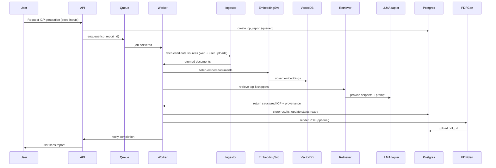

# ML / ICP generation pipeline

Purpose
This document describes the ML and retrieval pipeline used to generate evidence-backed Ideal Customer Profiles (ICPs), the tradeoffs for the MVP, and operational requirements.

Scope
- Ingestion and indexing of sources
- Embedding generation and vector store usage
- Retrieval-augmented generation (RAG) and prompt design
- Provenance mapping and PDF export
- Monitoring, evaluation and cost-control

Goals
- Produce ICPs with source-backed claims and low hallucination risk
- Keep inference costs predictable under the target budget (< $1,000/mo)
- Make the pipeline modular so LLM and vector providers can be swapped (OpenAI / OpenRouter / Pinecone / pgvector)

High-level pipeline components
1. Source ingestion (crawler / user uploads / partner APIs)
2. Parsing & chunking (text extraction, metadata)
3. Embedding generation and upsert
4. Vector search and retrieval
5. LLM adapter + RAG prompt execution
6. Post-processing, provenance assembly and validation
7. PDF rendering and export

Sequence diagram (Mermaid)

Ingestion & safe sources
- Start with a curated safe list of domains and partner APIs (e.g., industry reports, company sites, top tech blogs) to limit noise in MVP.
- Support user-supplied documents (PDF, Google Doc link, Notion export) with explicit consent for processing.
- Store raw HTML and extracted text in object storage (Supabase Storage or S3) and keep a reference id in Postgres for traceability.
- Implement a rate-limited crawler and respect robots.txt and site TOS.

Parsing & chunking
- Extract visible text, metadata (title, author, published_at), and language.
- Normalize whitespace, remove boilerplate (nav, footer) using heuristics or libraries (Readability, Mercury parser, boilerpipe).
- Chunk strategy:
  - Target chunk size: ~500 tokens (~300–700 words) with 50–20% overlap for context
  - Include metadata per chunk: source_url, start_offset, end_offset, domain, language
- Deduplicate identical chunks before embedding to save costs.

Embedding generation
- Provider: OpenAI embeddings (text-embedding-3-large) for MVP; abstract via adapter to switch to alternatives via OpenRouter.
- Batch embeddings (up to provider limits) to reduce cost and latency.
- Cache embeddings for identical chunk hash (SHA256) to avoid recompute.
- Upsert with metadata to Pinecone (namespace per tenant or shared namespace + tenant metadata).
- Store embedding provenance mapping in Postgres: chunk_id -> vector_id, source_url, saved_at.

Vector DB & indexing
- Use Pinecone for managed vector operations (scoring, metadata filtering, namespaces).
- Namespace strategy:
  - MVP: shared namespace with tenant filter metadata (simpler, lower ops)
  - Enterprise option: per-tenant namespace for stronger isolation
- Index tuning:
  - Distance metric: cosine or dot product depending on embedding provider
  - Top-K defaults: retrieve top-50 candidates, rerank to top-5 for prompt

Retrieval & reranking
- Hybrid retrieval strategy recommended:
  1) Vector search to get semantically similar chunks (top-50)
  2) Optional lightweight BM25/title filters to prefer exact matches on company names, locations, or keywords
  3) Rerank top candidates using a small cross-encoder or LLM reranker prompt (costly — use sparingly)
- For MVP: use plain vector top-20 then send top-5 snippets to LLM with context windows.

Prompt templates & LLM adapter
- Use an adapter pattern for LLM/embedding calls: [`docs/archDecisions/architecture.md`](docs/archDecisions/architecture.md:1) describes the architecture around this.
- Prompt design principles:
  - Provide explicit instructions to produce structured JSON matching the ICP schema.
  - Include retrieved snippets with explicit citations (e.g., [S1], [S2]) and their source_url.
  - Instruct model to only assert claims supported by snippets. If no supporting evidence, return "insufficient_evidence" for that claim.
  - Limit internal chain-of-thought; ask for concise, actionable outputs.
- Example prompt skeleton:
  - System: "You are an evidence-first marketing strategist. Use the provided snippets and produce a JSON ICP with fields: segment, persona, jobs, goals, problems, channels, sources. For each claim, include 'evidence' array with snippet IDs and urls."
- Adapter responsibilities:
  - Rate-limit and retry provider calls
  - Implement batching for embeddings
  - Record costs per request and attach usage metadata to job logs

Output schema and provenance
- Structured JSON output should conform to an explicit schema (example below).
- Every top-level claim must include a provenance array of {source_url, snippet_text, retrieval_score, chunk_id}.
- Example minimal JSON schema excerpt:
  {
    "segment": "Emerging-Market Digital Nomads (India, Nigeria...)",
    "persona": {
      "name": "Rahul",
      "age_range": "27–36",
      "jobs_to_be_done": [...],
      "evidence": [
        {"source_url":"https://example.com/article","snippet_id":"s_1234","retrieval_score":0.83}
      ]
    }
  }

Post-processing & validation
- Validate JSON against schema; reject or flag outputs failing required fields.
- Deduplicate evidence (normalize URLs, collapse multiple identical snippets).
- Compute confidence score heuristics based on retrieval scores and snippet counts.
- Allow human edits in UI; record edits as feedback signals (store diff and user_id).

PDF rendering & export
- Convert canonical JSON -> HTML template -> Puppeteer PDF
- Include "Sources" section with full citations and short snippets
- Embed traceability mapping in JSON and optionally as an appendix in the PDF
- Generate signed short-lived download URLs for distribution (`/reports/:id/download` -> signed URL)

Hallucination mitigation strategies
- RAG grounding as primary defense: always include retrieved snippets in prompt.
- Conservative prompting: instruct model to mark unsupported claims instead of inventing facts.
- Source thresholding: require minimum evidence count or average retrieval score to surface high-confidence claims.
- Human-in-the-loop: surface low-confidence claims in UI for manual verification before export.
- Automated hallucination detection: heuristics to flag claims mentioning dates/metrics that don't appear in retrieved sources.

Evaluation & continuous improvement
- Metrics to track:
  - Retrieval recall@k (against ground truth test set)
  - Hallucination rate (human-rated sample)
  - Generation latency and cost per report
  - User satisfaction (NPS, feedback on claims)
- Build a test corpus of real ICP examples (anonymized) to benchmark retrieval + generation.
- Capture training signals: user edits, source additions, manual verifications.

Fine-tuning & advanced model workflows (post-MVP)
- Option 1: fine-tune a supervised model on curated ICP examples for structured output (costly).
- Option 2: retrieval-augmented fine-tuning or reinforcement from human edits.
- For MVP, prefer prompt engineering and retriever improvements before fine-tuning.

Cost control & performance optimizations
- Cache embeddings and retrieval results for identical queries.
- Use smaller embedding models where acceptable, or reduce chunk size to reduce tokens.
- Progressive generation: quick "summary" generation with small context, optional "deep research" paid job with extended retrieval.
- Meter and quota user usage: warn users when approaching heavy-generation budgets.

Security & tenant isolation
- Respect tenant data isolation by metadata filters or per-tenant namespaces in Pinecone.
- Encrypt sensitive storage and never log full private documents; only store sanitized metadata and snippet references.
- Implement access controls for user-uploaded documents and allow deletion upon user request.

Data retention & compliance
- Retention policy for raw crawled content and vectors (e.g., default 90 days, configurable).
- Support data export and deletion for GDPR/CCPA compliance.
- Log processing consent for user-supplied content and avoid using private content to train models unless explicitly consented.

Scaling & operations
- Workers: autoscale based on queue length; use concurrency controls to avoid thundering herd on LLM provider.
- Vector store: monitor QPS and scale Pinecone pod sizes; use cost-aware tiering for older less-accessed vectors.
- Monitoring: track embedding queue latency, retrieval latency, LLM error rates, cost-per-generation; alert on anomalies.

MVP recommendations (concrete)
- Use Pinecone + OpenAI embeddings and GPT-4o/other managed models via an adapter.
- Start with a curated source list and limited crawler to reduce noise and cost.
- Implement top-20 retrieval + top-5 context to LLM, require explicit evidence mapping in outputs.
- Offer two generation modes: "fast" (cheap, small retrieval set) and "deep" (paid, larger retrieval + reranking).

Tradeoffs & alternatives
- Full cross-encoder reranking yields better precision but adds cost and latency.
- Per-tenant namespaces increase isolation and compliance but increase Pinecone index count and cost.
- Self-hosted embedding models reduce provider lock-in but increase ops complexity and GPU costs.

Appendices
- Sample prompt template: stored in code repo under `ml/prompts/icp_v1.json` (refer to implementation).
- Related docs: [`docs/archDecisions/mvp.md`](docs/archDecisions/mvp.md:1), [`docs/archDecisions/architecture.md`](docs/archDecisions/architecture.md:1), [`docs/Ideal customer profile Nomad Foundr.pdf`](docs/Ideal customer profile Nomad Foundr.pdf:1)

Owner: Roo (architect)
Last updated: 2025-10-11