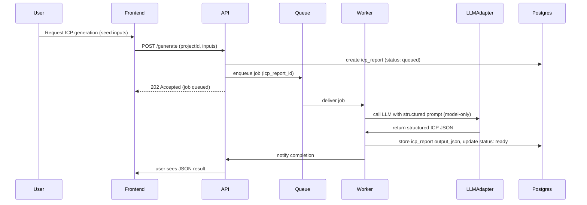
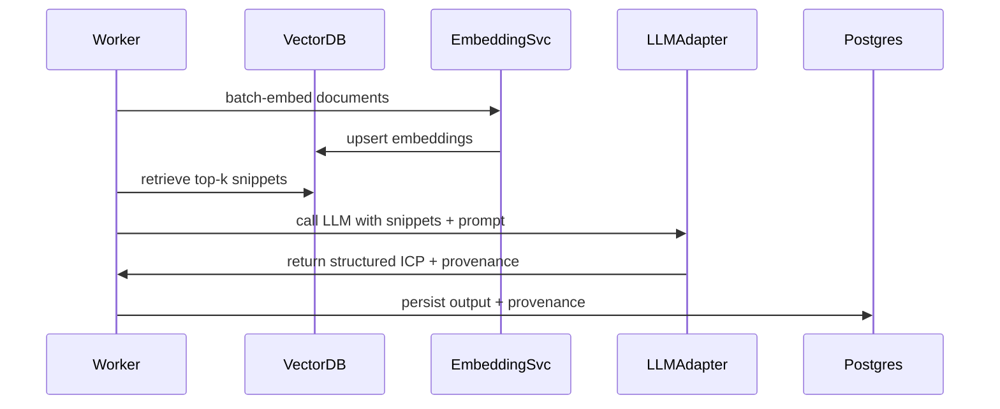

# ML / ICP generation pipeline

Purpose
This document now describes a two-stage approach for the ICP generator: Phase 1 (Model-only generation) and Phase 2 (Retrieval-Augmented Generation — RAG). The project will deliver Phase 1 quickly by relying on the model's parametric knowledge and strong prompt engineering; Phase 2 will add ingestion, embeddings and vector search to ground outputs in evidence.

Scope
- Phase 1: prompt-driven model-only ICP generation and validation
- Phase 2: ingestion, indexing, retrieval (RAG), and provenance mapping
- Post-processing, provenance assembly (Phase 2), PDF export
- Monitoring, evaluation and cost-control

Goals
- Phase 1: deliver a working ICP JSON generator (model-only) within 30 days to validate product fit and UX.
- Phase 2: add evidence-backed RAG to reduce hallucinations and provide provenance for each claim.
- Keep the pipeline modular so LLM and vector providers can be plugged in later.

Phase 1 — Model-only pipeline (fast path)
High-level components
1. Input normalization (seed company, short description, website URL)
2. Prompt assembly (schema-driven prompts with examples)
3. LLM invocation (managed provider via adapter)
4. JSON schema validation and lightweight consistency checks
5. Persist output_json in Postgres and surface in UI
6. Feedback capture (user edits stored as annotations for future model tuning)

Sequence diagram (Phase 1)

Key design points (Phase 1)
- Prompt engineering is critical: use system instructions and few-shot examples to enforce JSON structure and conservative assertions.
- Output validation: run JSON schema validation and lightweight heuristics to detect obvious hallucinations (e.g., claims with no supporting rationale in the prompt).
- Feedback loop: allow users to edit generated JSON; capture edits and use them as training signals for Phase 2 evaluation and prompt improvements.
- Cost control: monitor token usage per run and apply quotas or warn users for expensive operations.

Phase 1 prompt template guidelines
- Provide a strict instruction to output only the requested JSON fields and nothing else.
- Include a "confidence" field where the model estimates confidence (for user-facing flags).
- Example system instruction: "You are an evidence-aware marketing strategist. Produce a JSON ICP with fields: segment, persona, jobs_to_be_done, goals, problems, channels. If you cannot be confident about a claim, set confidence to 'low' and don't invent external facts."

Validation & QA (Phase 1)
- Build unit tests and sample inputs with expected schema shapes.
- Manual review: Senior Engineer inspects initial runs and approves prompt variants.
- Record token usage and estimate cost per run in `icp_reports.token_usage`.

Phase 2 — RAG pipeline (deferred)
Overview
Phase 2 will introduce ingestion, chunking, embeddings, a vector store, and a retrieval layer to ground model outputs in external evidence and provide provenance for every claim. The existing RAG design in previous drafts is retained but marked for Phase 2 implementation.

High-level Phase 2 components
1. Source ingestion (crawlers, public corpora, user uploads)
2. Parsing & chunking (text extraction, metadata)
3. Embedding generation and upsert (embeddings provider)
4. Vector search & retrieval (vector DB like Pinecone or pgvector)
5. Reranking & snippet selection
6. LLM RAG prompt execution with explicit snippets
7. Provenance mapping and UI for source editing
8. PDF export with sources appendix

Phase 2 rationale (brief)
- RAG reduces hallucination by forcing the LLM to ground claims in retrieved snippets.
- Provenance improves trust and enables users to verify/modify the evidence before exporting.
- RAG adds infra complexity and cost (vector DB, indexing, crawler), so it is scheduled after validating the core product in Phase 1.

Phase 2 sequence diagram (abbreviated)

Security & privacy (notes)
- Phase 1: do not send private PII to LLM providers unless explicit consent is captured.
- Phase 2: for user-uploaded private documents, require explicit opt-in to process and keep options to exclude such documents from training.

Cost & performance considerations
- Phase 1: cost dominated by LLM calls; optimize prompts and throttle heavy runs.
- Phase 2: additional costs from embeddings and vector DB operations; introduce batching, caching, and tiered retrieval modes.

Evaluation & readiness criteria for Phase 2
- Validate Phase 1 outputs against a human-reviewed corpus and ensure quality baseline.
- Prepare ingestion and deduplication tooling; seed a small curated corpus to pilot retrieval.
- Implement vector adapter (pgvector and/or Pinecone) and migration strategy (see [`docs/archDecisions/vector-store-choice.md`](docs/archDecisions/vector-store-choice.md:1)).

Appendices & references
- Prompt template: `ml/prompts/icp_v1.json` (Phase 1)
- RAG templates and retrieval prompt patterns (Phase 2): archived in `ml/prompts/rag_v1.json`
- Related docs: [`docs/archDecisions/architecture.md`](docs/archDecisions/architecture.md:1), [`docs/archDecisions/vector-store-choice.md`](docs/archDecisions/vector-store-choice.md:1), [`docs/archDecisions/data-storage.md`](docs/archDecisions/data-storage.md:1)

Owner: Roo (architect)
Last updated: 2025-10-12