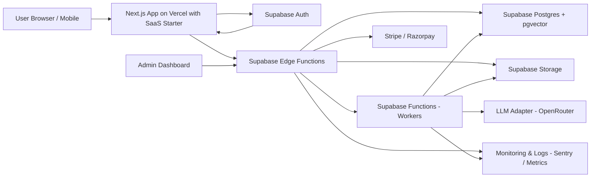
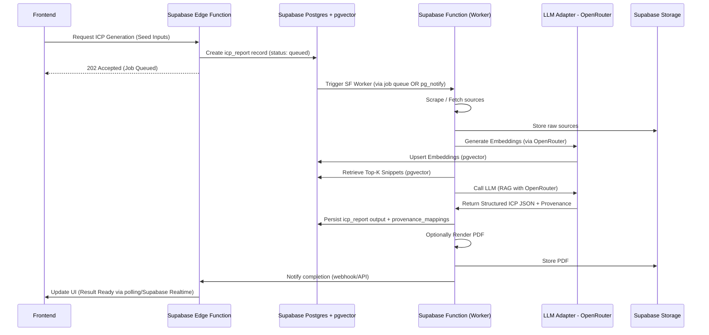

# Simplified Architecture Decisions for MVP Phase 1

## Purpose
This document records the high-level architecture, component diagrams, data flows, and rationale for the Elsa-like AI Marketing Assistant MVP with a focus on maximum simplification, cost-efficiency, and rapid development. It is aligned to a Supabase-first approach, leveraging Next.js with a SaaS starter template for the frontend, and OpenRouter for flexible LLM integration.

## Scope
- Centralized overview of major architectural components.
- RAG and ICP generation sequence.
- Data flow and provenance requirements.
- Core technical choices and rationale.

## Chosen Stack (MVP Phase 1)
- **Frontend:** Next.js (React + TypeScript) on Vercel, utilizing a SaaS starter template (e.g., shadcn.io/template/nextjs-saas-starter) for rapid development of common SaaS features and an intuitive UI/UX.
- **Backend (Supabase-centric):**
    - **Supabase Postgres with pgvector:** Central relational database, primary vector store for embeddings, and Postgres-based job queue.
    - **Supabase Auth:** Handles user authentication and authorization.
    - **Supabase Edge Functions:** For API endpoints, webhook handlers, and server-side logic beyond PostgREST.
    - **Supabase Functions (Workers):** For all background tasks including scraping, text chunking, embedding generation, LLM invocations, and PDF rendering.
    - **Supabase Storage:** For object storage (raw crawled content, user-uploaded documents, generated PDFs).
- **Embeddings & LLM:** OpenRouter (via LLM Adapter) for flexible model switching, cost optimization, and both LLM inference and embedding generation.

## High-Level Component Overview
- **Client (Browser/Mobile):** Next.js application hosted on Vercel, using a SaaS starter template to bootstrap UI/UX.
- **API/Serverless Backend:** Supabase Edge Functions for handling API requests and webhooks.
- **Relational & Vector Database:** Supabase Postgres with `pgvector` extension for all structured data and vector embeddings.
- **Background Processes:** Supabase Functions manage all heavy, asynchronous tasks.
- **LLM Provider:** OpenRouter, abstracted by a Supabase Function-based LLM Adapter.
- **Object Storage:** Supabase Storage for files.

## Key Constraints & Requirements Applied
- **Evidence Provenance:** Every generated claim must reference source URL(s) and snippet(s), stored and managed within Supabase Postgres.
- **Cost Control:** Prioritize solutions that offer predictable, low-cost scaling for MVP (e.g., `pgvector`, OpenRouter model flexibility).
- **Low Ops:** Maximize managed services, consolidating backend components within the Supabase ecosystem.
- **SaaS Features:** Rapid integration of user auth, subscriptions, billing, and admin via a customizable SaaS starter template.

## Component Diagram (Mermaid)


## Sequence Diagram: ICP Generation (Mermaid)


## Data Flow (Mermaid)
```mermaid
flowchart TD
  subgraph "User"
    U[User Input]
  end
  subgraph "Frontend"
    F[Next.js App]
  end
  subgraph "Backend - Supabase Ecosystem"
    EF[Edge Functions]
    DB[Postgres + pgvector]
    SF[Functions - Workers]
    STO[Storage]
    LLA[LLM Adapter - OpenRouter]
  end

  U --> F
  F --> EF
  EF --> DB
  EF --> STO
  EF --> SF
  EF --> LLA
  SF --> DB
  SF --> STO
  SF --> LLA
  LLA --> DB (for embeddings management)
  DB --> F (via API/Edge Functions)
```

## Component Responsibilities & Rationale

### Frontend (Next.js on Vercel with SaaS Starter)
- **Role:** User interface, data presentation, client-side logic, and integration point for pre-built SaaS features.
- **Rationale:** Next.js for performance, SEO, and robust application capabilities. SaaS starter template for accelerated development of common SaaS features (auth UI, dashboards, billing). Vercel for zero-config deployment.

### Backend (Supabase-centric)
- **Supabase Edge Functions (API Layer):**
    - **Role:** Handles core API endpoints, external webhook reception (payments), lightweight business logic, and job enqueuing.
    - **Rationale:** Serverless, Deno-based functions tightly integrated with other Supabase services, reducing the need for separate API servers.
- **Supabase Functions (Background Workers):**
    - **Role:** Executes all heavy, asynchronous, and long-running tasks: web scraping, text chunking, embedding generation, RAG retrieval, LLM invocation, PDF rendering, background integrations.
    - **Rationale:** Replaces external container orchestration (Cloud Run/Fargate) and dedicated queue systems (Redis/BullMQ), centralizing compute within Supabase.
- **Supabase Postgres with pgvector (Database & Vector Store):**
    - **Role:** Stores all relational data (users, projects, reports, etc.) and is the sole vector store for embeddings using the `pgvector` extension. Also acts as the job queue.
    - **Rationale:** Eliminates external vector databases (Pinecone) and Redis-based queues for MVP, simplifying the stack, reducing cost, and ensuring transactional consistency between data and vectors.
- **Supabase Auth:**
    - **Role:** Provides user identity management, authentication, and session handling.
    - **Rationale:** Fully managed, integrates seamlessly with Postgres RLS, and easily leveraged by the Next.js frontend and Edge/Functions.
- **Supabase Storage:**
    - **Role:** Object storage for raw crawled data, user-uploaded documents, and generated PDFs.
    - **Rationale:** Managed, S3-compatible storage integrated within the Supabase platform.

### LLM Integration (OpenRouter + Adapter)
- **LLM Adapter (Supabase Function):**
    - **Role:** A thin service deployed as a Supabase Function, abstracting LLM provider differences.
    - **Rationale:** Centralizes logic for model switching, rate-limiting, retries, prompt templating, and cost tracking. Ensures provider independence.
- **OpenRouter (Primary LLM/Embedding Provider):**
    - **Role:** Provides access to various LLM models for both inference (ICP generation) and embedding generation.
    - **Rationale:** Offers superior flexibility and cost control by allowing dynamic switching between different models and providers via a single API.

## Data Storage & Schema Highlights
- **Unified Data Layer:** All data (relational, vector embeddings, job queue details) resides within Supabase Postgres.
- **`embeddings_meta` table:** Specifically designed to leverage `pgvector` for efficient vector storage and similarity search.
- **`jobs` table:** A Postgres-based queue for managing asynchronous tasks for Supabase Functions.
- **`provenance_mappings` table:** Explicitly links generated claims to source snippets, supporting evidence-backed reports.

## Tradeoffs & Alternatives (for Simplified Stack)
- **Vector DB:** `pgvector` is `MVP-first` for cost-efficiency and simplicity. Specialized external DBs (e.g., Pinecone) are a consideration for extreme scale or specialized requirements beyond MVP.
- **LLM Provider:** OpenRouter offers flexibility and cost control. The adapter pattern allows for swapping or adding other providers if needed.
- **Worker Runtime:** Supabase Functions provide deep integration and managed ops for MVP, replacing more generalized (and complex to manage) solutions like Cloud Run/Fargate.
- **Frontend Development:** SaaS starter template accelerates development velocity for common components, balancing customization with speed over entirely custom builds.

## Scalability & Cost-Control Patterns
- **LLM Cost Optimization:** Flexible model selection via OpenRouter, aggressive caching of embeddings, prompt engineering, and token monitoring.
- **Supabase Scaling:** Leveraging Supabase's managed scaling for Postgres, Edge Functions, and Functions.
- **Usage Quotas:** Implemented and enforced via Supabase Edge Functions and RLS.

## Security & Privacy
- **Supabase Features:** TLS everywhere, encryption at rest (managed Postgres), Row-Level Security (RLS) for tenant isolation, Supabase Secrets for sensitive credentials.
- **Data Governance:** Support for GDPR/CCPA compliance, PII masking, consent management for user data.

## Continuous Integration & Deployment (CI/CD)
- **GitHub Actions:** Automates testing, linting, building, and deployment using Vercel for the frontend and Supabase CLI for backend functions and database migrations.

## References
- Key architectural choices are detailed in the accompanying `mvp-plan.md` and `cross-cutting-concerns.md` documents.

Owner: Roo (architect)
Last updated: 2025-10-25