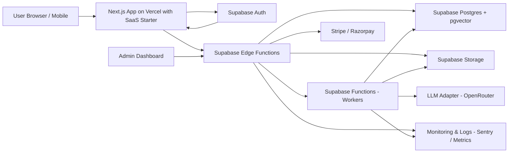
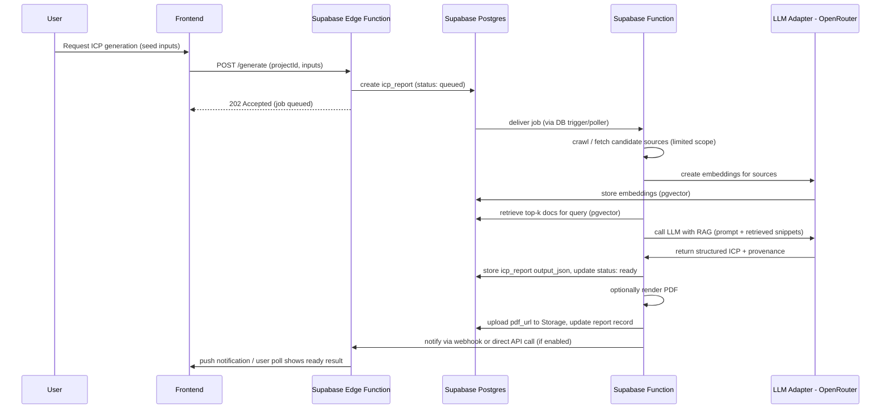

# Architecture decisions — component & data-flow (Simplified for MVP Phase 1)

Purpose
This document records the high-level architecture, component diagrams, data flows, and rationale for the Elsa-like AI Marketing Assistant MVP, with a focus on maximum simplification and cost-efficiency. It is aligned to a Supabase-first approach, leveraging Next.js with a SaaS starter template for the frontend, and OpenRouter for flexible LLM integration.

Scope
- Component-level architecture (frontend, API, serverless functions, vector store, DB, storage)
- RAG and ICP generation sequence
- Data flow and provenance requirements
- Tradeoffs and alternatives for the simplified stack

Chosen stack (MVP)
- Frontend: Next.js (React + TypeScript) on Vercel, utilizing a SaaS starter template (e.g., shadcn.io/template/nextjs-saas-starter) for rapid development of common SaaS features.
- Auth / relational DB / vector DB / storage / API / background workers: Supabase (Postgres with pgvector, Auth, Storage, Edge Functions, Functions for background tasks).
- Embeddings & LLM: OpenRouter (via LLM Adapter) for flexible model switching and cost optimization.
- Payments: Stripe + Razorpay (INR / UPI) integrated into the Next.js frontend with backend webhooks handled by Supabase Edge Functions.
- Observability: Sentry + OpenTelemetry (adapted for Supabase functions) + Prometheus (for metrics if self-hosted or via integrations).

High-level component overview
- Client (browser/mobile) — Next.js app on Vercel (using SaaS starter template)
- API Gateway / Serverless API — Supabase Edge Functions (for specific API routes and webhooks)
- Relational DB — Supabase Postgres (users, projects, reports, billing, job queue)
- Vector DB — Supabase Postgres with pgvector (embeddings + retrieval)
- Embeddings/LLM Adapter — a thin service deployed as a Supabase Function that abstracts OpenRouter calls and model switching
- Worker(s) — Supabase Functions managing scrape/index, embed, retrieval, LLM invocations, PDF rendering
- Storage — Supabase Storage for PDFs, assets, and raw crawled content
- Payments — Stripe & Razorpay integrations (frontend via SDK, backend webhooks via Supabase Edge Functions)
- Admin UI — internal dashboard within Next.js app, interacting with Supabase Edge Functions
- Observability — integrated with Supabase logs/metrics, Sentry.

Key constraints & requirements applied
- Evidence provenance: every generated claim must reference source URL(s) and snippet(s)
- Cost control: batching embeddings, caching retrievals, and reuse of embeddings
- Low ops initially: prefer managed serverless services, consolidating on Supabase

Component diagram (Mermaid)


Sequence diagram: ICP generation (Mermaid)


Data flow (Mermaid)
```mermaid
flowchart TD
  subgraph "User"
    U[User Input]
  end
  subgraph "Frontend"
    F[Next.js App]
  end
  subgraph "Backend - Supabase"
    EF[Edge Functions]
    DB[Postgres + pgvector]
    SF[Functions - Workers]
    STO[Storage]
    LLA[LLM Adapter - OpenRouter]
  end

  U --> F
  F --> EF
  EF --> DB
  EF --> STO
  EF --> SF
  SF --> DB
  SF --> STO
  SF --> LLA
  LLA --> DB (for embeddings)
  DB --> F (via API/Edge Functions)
```

Component responsibilities & rationale
- Frontend (Next.js on Vercel with SaaS Starter)
  - Fast, SEO-friendly marketing pages + SPA for app
  - Server-side rendering for public pages and client-side for app flows
  - Turbo-charges development with pre-built user management, subscription flows, and UI components.
  - Advantage: low friction deployment and CDN combined with rapid feature development.
- Supabase Edge Functions (API)
  - Replaces traditional Node.js/TypeScript APIs for many endpoints.
  - Handles auth, project CRUD, payment webhooks, job enqueue.
  - Deployable as serverless functions, tightly integrated with Supabase services.
- Supabase Functions (Worker)
  - Handles heavy background tasks: scraping, embeddings, indexing, LLM calls, PDF rendering.
  - Replaces external container runtimes (Cloud Run/Fargate) and custom job queues (Redis/BullMQ).
  - Runs on a managed serverless platform, reducing operational burden.
- Supabase Postgres with pgvector (Vector DB)
  - Central relational database for all application data.
  - `pgvector` extension provides native vector capabilities, eliminating external vector DB (Pinecone). Simplifies stack and reduces cost for MVP.
  - Transactional integrity between relational data and embeddings.
- Embeddings & LLM Adapter (Supabase Function)
  - Abstracts LLM provider differences, primarily targeting OpenRouter.
  - Central place for model switching, rate-limiting, retries, prompt templating, and cost control. Deployed as a Supabase Function for tight integration.
- Supabase Storage
  - Stores PDF reports, images, assets, and archived crawled pages.
- Payments
  - Stripe for global cards; Razorpay for Indian payments and UPI. Integrations managed via frontend SDKs and Supabase Edge Functions for webhook processing.
- Observability
  - Capture errors (Sentry), traces (OpenTelemetry adapted for Supabase), metrics (Supabase native where available, custom where needed).

RAG & provenance design details
- Source ingestion: Small, targeted crawler or third-party APIs (news, web snapshots); storing raw HTML + extracted text + metadata in Supabase Storage.
- Embedding & indexing: Chunk text, create embeddings using OpenRouter (via Adapter), and upsert into Supabase Postgres with `pgvector` (using metadata like source_url, title, position).
- Retrieval: Use semantic similarity + metadata filters within `pgvector` to select top-k snippets.
- LLM prompt design: Use OpenRouter and prompt templates that require the model to cite sources (force provenance); include a "hallucination guard."
- Provenance store: Store mapping from each generated claim → list of source_snippets (url, text, retrieval_score) in Supabase Postgres.

Tradeoffs & alternatives (Revisited for Simplified Stack)
- Vector DB: Supabase pgvector is chosen for MVP for cost-efficiency and simplification. Pinecone is a potential upgrade for very high scale/performance but adds complexity.
- LLM provider: OpenRouter chosen for flexibility and cost optimization, allowing dynamic model switching. OpenAI is an option via OpenRouter.
- Worker runtime: Supabase Functions chosen for complete integration within the Supabase ecosystem, replacing external container services for MVP.
- Frontend Development: Next.js SaaS starter template chosen for rapid development and best practices, balancing flexibility with speed. Custom UI development is generally slower but offers ultimate flexibility.

Scalability & cost-control patterns
- Cache embeddings and retrieval results for identical inputs in Supabase Postgres.
- Batch embed requests and reuse existing indexed content across reports where appropriate.
- Implement prompt cost estimator and warn users for "deep research" runs.
- Add per-user quotas and rate limits using Supabase RLS and custom logic in Edge Functions.
- Progressive disclosure: quick "summary" ICP with small retrieval set and optional "deep research" job for paid tier.

Security & privacy
- TLS for all transport; secure cookies; HttpOnly tokens for auth (handled by Supabase Auth).
- Encrypt sensitive columns at rest (Supabase manages Postgres encryption). Use Supabase Vault or environment variables for API keys.
- Data deletion: offer per-project deletion and export to comply with GDPR/CCPA.
- Privacy-by-default: opt-out of using user content for internal model training; require explicit consent.
- Least privilege for Supabase service roles and API keys.

Operational concerns & CI/CD
- Repos: monorepo with packages (frontend, Supabase functions/edge functions, infra).
- CI: GitHub Actions for tests, linting, build, and deploy steps. Supabase CLI deployment for functions.
- IaC: Terraform for production infra, or simpler scripts for MVP to manage Supabase resources directly.
- Backups: Automate Supabase Postgres snapshot/export retention.

Monitoring & SLOs
- Core SLO: 99.9% availability for auth and project access; generation jobs are best-effort with queueing.
- Instrument: request latencies, Supabase Function execution times, LLM error rates, cost-per-generation. Use Supabase native logging and integrate with Sentry.
- Alerts: Supabase logs based alerts, LLM provider failures, payment failures, Supabase Function timeouts.

Next steps (files to produce)
- `docs/archDecisions/frontend.md` — frontend stack analysis and component responsibilities (update for SaaS starter)
- `docs/archDecisions/backend.md` — API design using Supabase Edge Functions, Supabase Functions for workers, `pgvector` integration (update significantly)
- `docs/archDecisions/data-storage.md` — schema and data retention policies (update for `pgvector` as primary)
- `docs/archDecisions/ml-pipeline.md` — RAG pipeline using Supabase Functions, OpenRouter via adapter, `pgvector` (update significantly)
- `docs/archDecisions/integrations.md` — payments, connectors, webhooks (update for Supabase Edge Functions)
- `docs/archDecisions/infrastructure.md` — deployment, IaC, CI/CD (update for Supabase Functions/Edge Functions)
- `docs/archDecisions/security.md` — security posture, encryption, compliance
- `docs/archDecisions/observability.md` — logs, traces, metrics, alerts (update for Supabase native tooling)
- `docs/archDecisions/cost.md` — cost model and optimizations (update for Supabase & OpenRouter focus)
- `docs/archDecisions/ICP-insights.md` — ICP-specific architecture adjustments
- `docs/archDecisions/roadmap.md` — implementation milestones and estimates (update for simplified stack)
- `docs/archDecisions/vector-store-choice.md` – (will be deprecated or heavily revised to state `pgvector` as primary)

Owner: Roo (architect)
Last updated: 2025-10-25

References
- `docs/Ideal customer profile Nomad Foundr.pdf`
- https://www.m1-project.com/
- `docs/archDecisions/requirements.md`
- `docs/archDecisions/mvp.md`