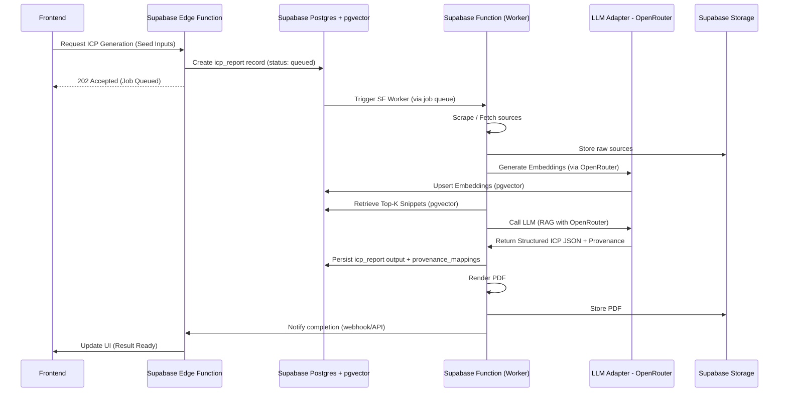

# ML / ICP generation pipeline (Simplified for MVP Phase 1)

Purpose
This document now describes the ML/ICP generation pipeline for MVP Phase 1, prioritizing a Retrieval-Augmented Generation (RAG) approach that fully leverages Supabase and OpenRouter. The project aims for rapid delivery of an evidence-backed ICP JSON generator with provenance.

Scope
- Source ingestion, chunking, embeddings using Supabase Functions.
- Vector store and retrieval using Supabase Postgres with `pgvector`.
- LLM invocation via an adapter leveraging OpenRouter.
- Post-processing, provenance assembly, and PDF export (handled by Supabase Functions).
- Monitoring, evaluation and cost-control.

Goals
- Deliver a working ICP JSON generator with RAG within the MVP timeframe to validate product fit and UX.
- Ensure all outputs are evidence-backed to reduce hallucinations and provide provenance for each claim.
- Leverage OpenRouter via a modular LLM adapter for flexible model switching and cost optimization.

High-level components
1.  **Input normalization:** Seed company, short description, website URL (handled by Next.js frontend and Supabase Edge Functions).
2.  **Source ingestion:** Supabase Function worker crawls/fetches sources, extracts text, stores raw content in Supabase Storage.
3.  **Parsing & chunking:** Supabase Function worker chunks text into passages with metadata.
4.  **Embedding generation:** Supabase Function worker calls LLM Adapter (OpenRouter) to create embeddings for chunks.
5.  **Vector store & upsert:** Embeddings are upserted into Supabase Postgres with `pgvector`.
6.  **Retrieval:** Supabase Function worker queries `pgvector` to retrieve top-k relevant snippets.
7.  **Prompt assembly:** Supabase Function worker formats a RAG prompt including retrieved snippets.
8.  **LLM invocation:** Supabase Function worker calls LLM Adapter (OpenRouter) with the RAG prompt.
9.  **JSON schema validation and consistency checks:** Supabase Function worker validates and refines LLM output.
10. **Provenance mapping:** Supabase Function worker maps generated claims to source snippets and persists in Supabase Postgres.
11. **Persist output:** `icp_report` output JSON and status updated in Supabase Postgres.
12. **PDF generation & storage:** Supabase Function worker renders PDF and stores in Supabase Storage.

Sequence diagram (Simplified RAG Pipeline)

Key design points
-   **Supabase Functions for all worker tasks**: Consolidates heavy processing, including scraping, embedding, retrieval, LLM calls, and PDF rendering, eliminating external worker platforms.
-   **Supabase Postgres with `pgvector`**: Serves as the integrated relational and vector database, simplifying infrastructure and data consistency.
-   **LLM Adapter for OpenRouter**: Provides a flexible and cost-effective interface to various LLM models through OpenRouter, allowing dynamic model switching without code changes.
-   **RAG-first approach**: From MVP Phase 1, the pipeline will incorporate retrieval to ground LLM outputs in evidence, enhancing accuracy and trustworthiness.
-   **Provenance:** All generated claims are explicitly linked to source snippets and URLs, stored in `provenance_mappings` table.

Prompt template guidelines
- Provide strict instructions to output only the requested JSON fields and nothing else, leveraging a JSON schema if possible.
- Include a "confidence" field where the model estimates confidence (for user-facing flags and for potential internal logging).
- Leverage retrieved snippets directly within the prompt to encourage evidence-based generation.
- Example system instruction: "You are an evidence-aware marketing strategist. Using only the provided context, produce a JSON ICP with fields: segment, persona, jobs_to_be_done, goals, problems, channels, and provide a source URL for each claim. If you cannot find evidence, state 'Insufficient Evidence'."

Security & privacy
- Do not send private PII to LLM providers unless explicit consent is captured and anonymized/redacted.
- Implement robust input validation and sanitization within Supabase Functions before processing or sending to LLMs.
- For user-uploaded private documents, require explicit opt-in to process and ensure options to exclude such documents from training data collection.

Cost & performance considerations
- Cost dominated by LLM calls and embedding generation. OpenRouter allows model selection for cost optimization.
- Optimize Supabase Functions for efficient execution, batching embedding requests where possible.
- Utilize `pgvector` indexing efficiently to ensure fast retrieval.

Evaluation & readiness criteria for MVP Phase 1
- Generated ICP outputs conform to the specified JSON schema and include provenance.
- The RAG process successfully retrieves relevant information from indexed sources.
- Token usage is recorded per run for cost analysis and quota enforcement.
- System demonstrates low operational overhead due to Supabase-centric design.

Appendices & references
- Prompt templates: `ml/prompts/icp_v1.json`
- Related docs: [`docs/archDecisions/architecture.md`](docs/archDecisions/architecture.md:1), [`docs/archDecisions/data-storage.md`](docs/archDecisions/data-storage.md:1), [`docs/archDecisions/vector-store-choice.md`](docs/archDecisions/vector-store-choice.md:1)

Owner: Roo (architect)
Last updated: 2025-10-25